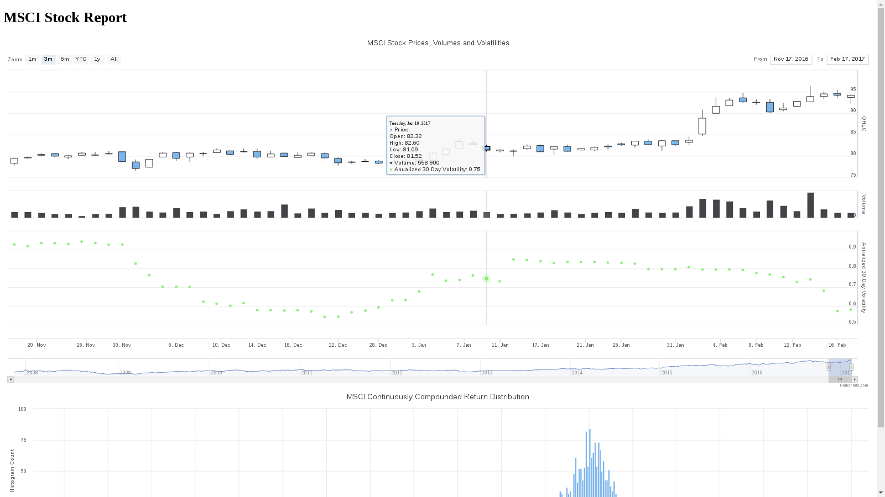

# trady - the stock engine

Setup a development instance:
```
python setup.py develop
pserve --reload development.ini
```

Now point your browser to http://0.0.0.0:6543/stock-report?symbol=MSCI.

Here is a screenshot of what you will see:
